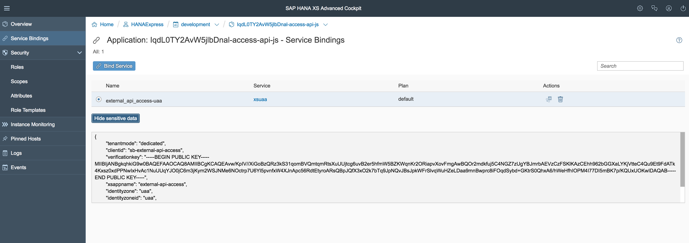
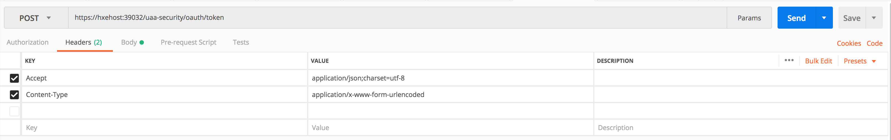
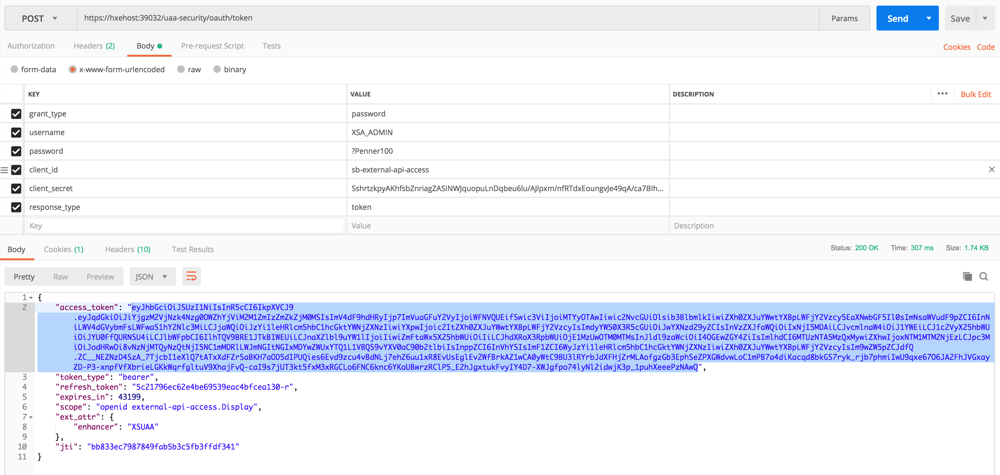
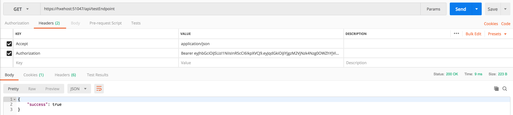
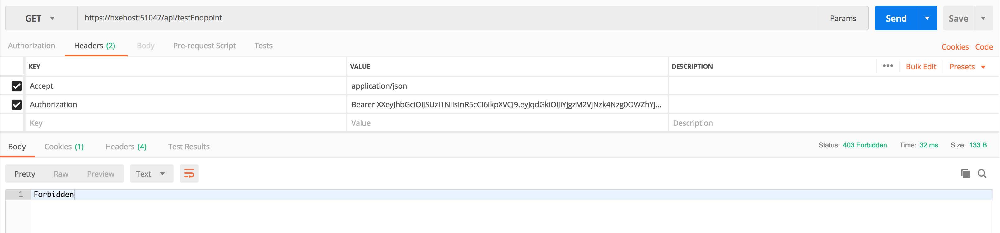

# Test external Access to XS Advanced API using OAuth

## Info
Can be done e.g. by using the Cloudfoundry UAA Password Grant with Client and User Credentials: POST /oauth/token
[Official Documentation](https://github.com/cloudfoundry/uaa/blob/develop/docs/UAA-APIs.rst)

## Get required information (e.g. UAA auth server URL, client id, client secret)
Via XS CLI.

Or XSA Cockpit

## Get Access Token

## Call API with access token
Success

Error
